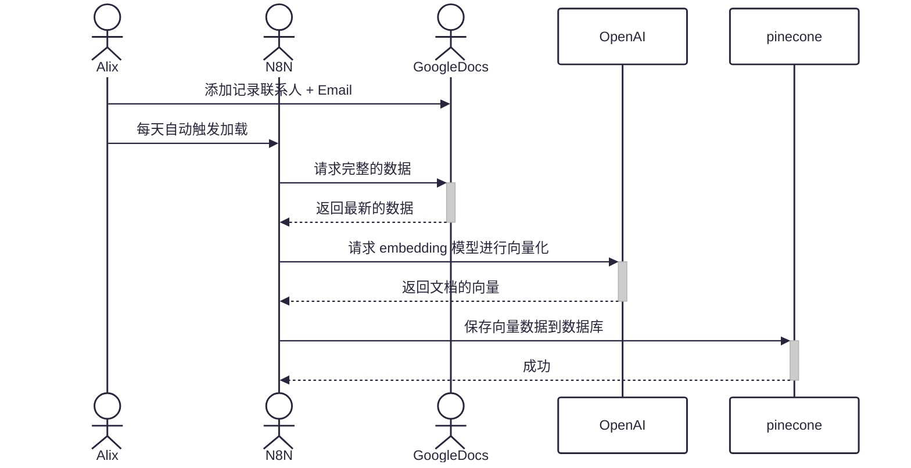
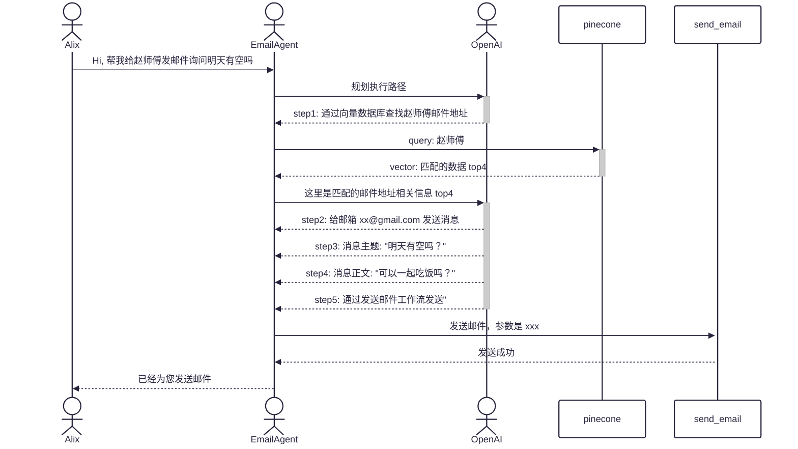

# 002 - 小白教程-最简单的邮件 AI Agent

[Youtube 教程视频](https://www.youtube.com/watch?v=P9CtkBSOByM&t=550s&ab_channel=%E8%B5%9B%E5%8D%9A%E7%A8%8B%E5%BA%8F%E5%91%98%E8%B5%B5%E5%B8%88%E5%82%85)

## 如何使用此工作流

不需要写代码，不需要编程知识，不需要任何工作流知识。一步一步教你实现一个 N8N Email AI Agent，帮助你出海跟老外用邮件打交道效率高到飞起来。
一步一步的演示，喂饭到你嘴里，让你学会 N8N 这个最实用的 AI 工作流平台的功能。学会这个，你还怕做不出来自己想要的邮件 Agent 效果？
使用自己的 sheet，注意按照工作流指引进行修改！

### 要求

- [OpenRouter API 密钥](https://openrouter.ai/settings/keys)
- [GoogleSheet Oauth2](https://docs.n8n.io/integrations/builtin/credentials/google/oauth-single-service/)
- [Pinecone](https://www.pinecone.io/)

## 额外说明

load contracts 核心流程:

email agent 核心流程:

